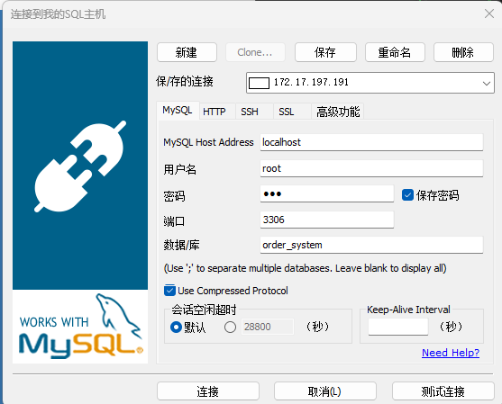
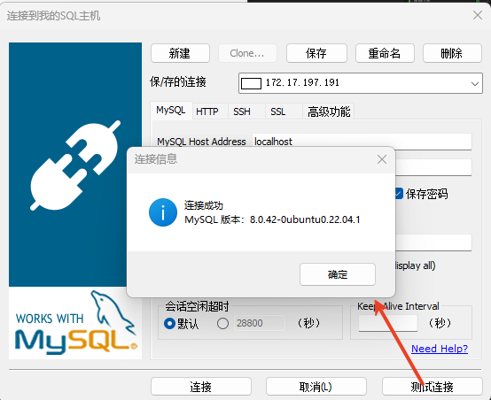
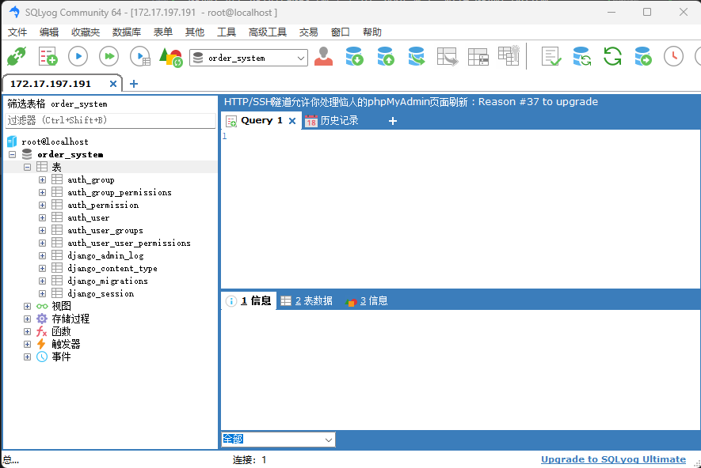
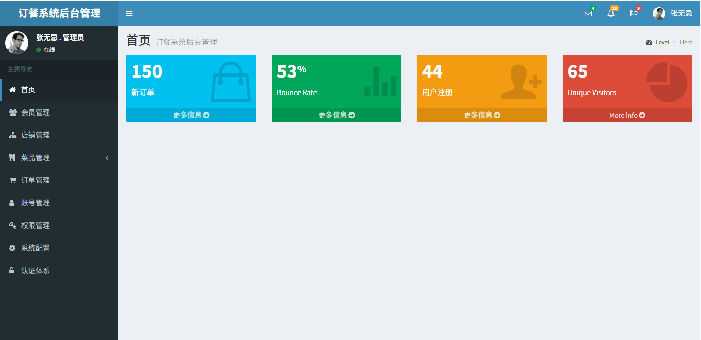
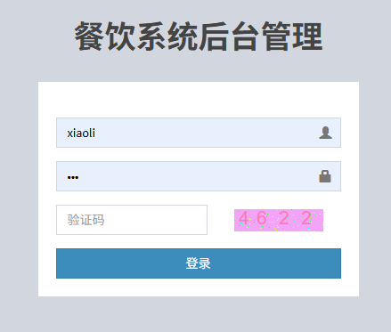
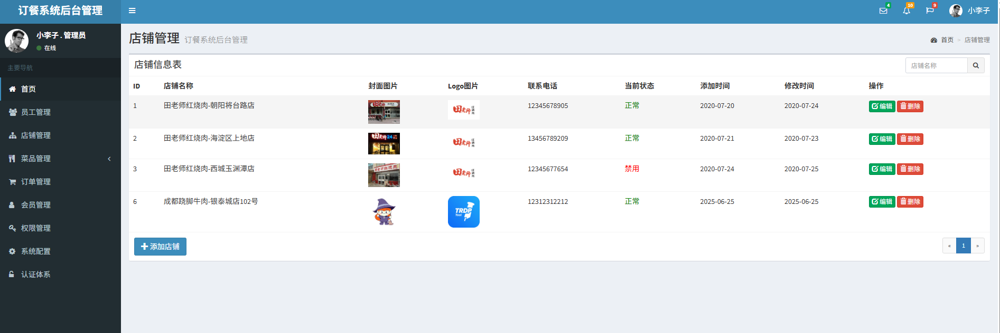

# Django-Order-System
This is a order system created by django . we can study the web admin and mobile front-end technology. Thanks to Lagou Education.

# Project Structure
```
orderproject/
├── myadmin/ 
│   ├── admin.py
│   ├── apps.py
│   ├── migrations/
│   ├── models.py
│   ├── tests.py
│   ├── urls.py
│   └── views.py
├── orderproject/
│   ├── asgi.py
│   ├── settings.py
│   ├── urls.py
│   └── wsgi.py
├── web/
│   ├── apps.py
│   ├── migrations/
│   ├── models.py
│   ├── tests.py
│   ├── urls.py
│   └── views.py
├── mobile/
│   ├── apps.py
│   ├── migrations/
│   ├── models.py
│   ├── tests.py
│   ├── urls.py
│   └── views.py
├── manage.py
├── templates/
│   ├── myadmin/
│   ├── web/
│   └── mobile/
├── static/
│   ├── myadmin/
│   │   ├── brower_components/
│   │   ├── dist/
│   │   ├── local/
│   │   ├── package.json
│   ├── web/
│   └── mobile/
├── README.md
```
# Project Environment 
```
  My environment: Windowsx64 + WSL2 + Ubuntu 20.04 + Python 3.10.12 + Django 5.2.3 + MySQL 8.0.42 + MySQL Connector 8.0.42 + MysqlClient-2.2.7
```

## Install Python and Django
```
sudo apt-get install python3-pip
pip3 install django
```
## Install MySQL
```
sudo apt-get install mysql-server
```
## Install MySQL Connector
```
pip3 install mysql-connector-python
```
## Install MysqlClient
```
pip install  mysqlclient
```
## Install Django Debug Toolbar
```
pip3 install django-debug-toolbar
```
## Install Django Rest Framework
```
pip3 install djangorestframework
```

# How to Create and Run the Project
```
django-admin startproject orderproject
cd orderproject
python manage.py startapp myadmin
python manage.py startapp web
python manage.py startapp mobile
```

# Database Configuration
```
DATABASES = {
    'default': {
        'ENGINE': 'django.db.backends.mysql',
        'NAME': 'order_system',
        'USER': 'root',
        'PASSWORD': 'root',
        'HOST': 'localhost',
        'PORT': '3306',
    }
}
```


## Login to mysql
```
mysql -u root -p
```
## Create database
```
CREATE DATABASE order_system;
```
## Grant permission to user (optional)
```
GRANT ALL PRIVILEGES ON order_system.* TO 'root'@'localhost' IDENTIFIED BY 'root';
```
## Exit mysql
```
exit
```
## Check WSL(Ubuntu) state (optional)
```
sudo service mysql start   # start MySQL
sudo service mysql status  # check MySQL status
```
## Modify MySQL remote access (optional)
```
sudo vi /etc/mysql/mysql.conf.d/mysqld.cnf
```
```
bind-address = 0.0.0.0
```
```
sudo service mysql restart
```
# Add App to Installed Apps to Activate them
```
INSTALLED_APPS = [
    'django.contrib.admin',
    'django.contrib.auth',
    'django.contrib.contenttypes',
    'django.contrib.sessions',
    'django.contrib.messages',
    'django.contrib.staticfiles',
    'myadmin',
    'web',
    'mobile',
]
```

# Database Migrations
```
python manage.py makemigrations
python manage.py migrate
```
# Use SQLyog to test database connection on Windows
## Install SQLyog on Windows
```
https://www.sqlyog.com/download/
```

## Make sure 'root' user can access from WSL

### step 1: Login to mysql in WSL
```
sudo mysql -u root
```
### step 2: Modify root password
```
-- 允许 root 从任意 IP 登录（生产环境不推荐！）
ALTER USER 'root'@'localhost' IDENTIFIED WITH mysql_native_password BY '你的密码';
CREATE USER 'root'@'%' IDENTIFIED WITH mysql_native_password BY '你的密码';
GRANT ALL PRIVILEGES ON *.* TO 'root'@'%' WITH GRANT OPTION;
FLUSH PRIVILEGES;
```
### step 3: Check root user
```
SELECT Host, User FROM mysql.user WHERE User = 'root';
```
output:   
+-----------+------+  
| &nbsp; &nbsp; Host &nbsp; &nbsp; | &nbsp; User  |  
+-----------+------+  
| &nbsp;  localhost   | &nbsp;&nbsp;root |  
|&nbsp;&nbsp;&nbsp;&nbsp;&nbsp; % &nbsp; &nbsp;  &nbsp;&nbsp;&nbsp;&nbsp;&nbsp;| &nbsp;  root |    ← 新增的远程访问权限  
+-----------+------+  

### step 4: Exit mysql
```
exit
```
## Connect to MySQL from Windows by SQLyog
### Test root user connection with SQLyog or other tools
Effict pictures:





# Other Configuration

## Templates Configuration
```
TEMPLATES = [
    {
        'BACKEND': 'django.template.backends.django.DjangoTemplates',
        'DIRS': [os.path.join(BASE_DIR, 'templates')],
        'APP_DIRS': True,
        'OPTIONS': {
            'context_processors': [
                'django.template.context_processors.debug',
                'django.template.context_processors.request',
                'django.contrib.auth.context_processors.auth',
                'django.contrib.messages.context_processors.messages',
            ],
        },
    },
]
```
## Static Files Configuration
```
STATIC_URL = '/static/'
STATICFILES_DIRS = [
    os.path.join(BASE_DIR,'static'),
]
```

## Allowed Hosts Configuration
```
ALLOWED_HOSTS = ['*']
```
## Locales Configuration
```
LANGUAGE_CODE = 'zh-hans'
TIME_ZONE = 'Asia/Shanghai'
USE_I18N = True
USE_L10N = True
USE_TZ = True
```

# Third-party Plugins

## AdminLTE
### Install AdminLTE
```
从github上下载一个后台简洁模板：https://github.com/ColorlibHQ/AdminLTE
将后台模板目录中的资源目录：bower_components、dist、local、package.json复制到项目的后台静态资源目录static/myadmin/中
在templates/myadmin/目录中创建一个基类父模板文件base.html
在templates/myadmin/index/目录中创建一个首页模板文件index.html
在templates/myadmin/目录中创建一个信息提示模板文件info.html
```
## Install Pillow
from PIL import Image, ImageDraw, ImageFont
```
pip3 install Pillow
```
# Run the server 
```
python manage.py runserver
```
# Access the Admin Page
```
http://localhost:8000/myadmin/
```



# Database Import
```
在db文件夹中通过SQLyog执行SQL文件（osdb20200720.sql）导入数据即可

```

# Version Update
&nbsp;&nbsp;&nbsp;&nbsp;每一个Tag代表一个阶段的功能开发、可以下载不同的Tag代码进行循序渐进的学习。
## v0.1.0
- 完成数据库搭建、数据导入和环境以及第三方插件的安装。
- 完成前后端分离，前端使用AdminLTE模板，后端使用Django开发。
- 完成基础框架的搭建，模块分为：myadmin、web、mobile。

## v0.2.0
- 完成用户CURD操作。

## v0.3.0
- 完成后台用户管理登录和登出操作。
- 完成验证码功能。  
  


## v0.4.0
- 完成店铺管理CURD相关功能。

  
